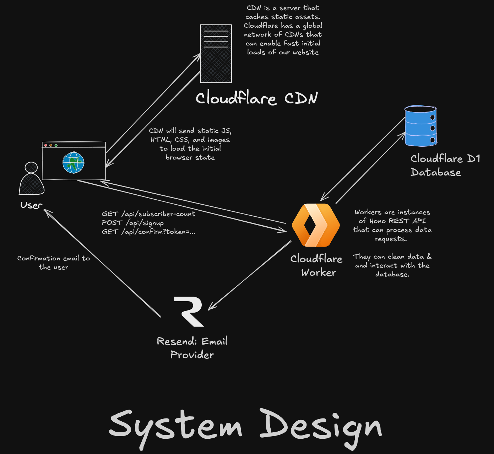

<div align="center">

# Waitlist

### A Production-Grade Waitlist System Built with Modern Web Technologies

[](https://github.com)
[](https://astro.build)
[](https://hono.dev)
[](https://workers.cloudflare.com)

---

**A reusable, scalable waitlist solution designed to validate SaaS ideas and capture early adopters.**

[Project Outline](./OUTLINE.md) · [Tech Stack Details](./TECHSTACK.md) · [Cloudflare Setup](./CLOUDFLARE.md)

</div>

---

**Work in Progress**: This project is currently under active development. Features and documentation may change frequently.

---

## Overview

This project is a full-stack, production-grade waitlist system built to validate product ideas and capture early user interest. It leverages modern web technologies with a focus on performance, scalability, and developer experience.

The motivation behind this project is to create a reusable waitlist foundation that can be deployed for testing future SaaS ideas quickly and efficiently.

## Architecture



## Key Features

- **Email Signup Flow** — Complete user registration with email validation and confirmation
- **Real-time Subscriber Count** — Live updates for social proof
- **Bot Prevention** — Cloudflare Turnstile integration for spam protection
- **Global Edge Deployment** — Powered by Cloudflare Workers for low-latency responses
- **SEO Optimized** — Static site generation with Astro for maximum performance
- **Mobile-First Design** — Responsive UI built with TailwindCSS and DaisyUI

## Tech Stack

| Layer                  | Technology                                                              |
| ---------------------- | ----------------------------------------------------------------------- |
| **Frontend Framework** | [Astro](https://astro.build)                                            |
| **UI Library**         | [React](https://react.dev)                                              |
| **Styling**            | [TailwindCSS](https://tailwindcss.com) + [DaisyUI](https://daisyui.com) |
| **Backend Runtime**    | [Hono](https://hono.dev) on Cloudflare Workers                          |
| **Database**           | [Cloudflare D1](https://developers.cloudflare.com/d1/) (SQLite)         |
| **ORM**                | [Drizzle ORM](https://orm.drizzle.team)                                 |
| **Package Manager**    | [pnpm](https://pnpm.io)                                                 |

> For a detailed breakdown of the tech stack, see [TECHSTACK.md](./TECHSTACK.md)

## Documentation

| Document                         | Description                                             |
| -------------------------------- | ------------------------------------------------------- |
| [OUTLINE.md](./OUTLINE.md)       | Complete project outline, goals, and planned features   |
| [TECHSTACK.md](./TECHSTACK.md)   | Detailed frontend, backend, and database specifications |
| [CLOUDFLARE.md](./CLOUDFLARE.md) | Detailed clouflare services discussion                  |

## Getting Started

### Prerequisites

- [Node.js](https://nodejs.org) (v18 or higher recommended)
- [pnpm](https://pnpm.io) package manager
- [Wrangler CLI](https://developers.cloudflare.com/workers/wrangler/) for Cloudflare deployments

### Local Development

1. **Clone the repository**

   ```bash
   git clone https://github.com/your-username/waitlist.git
   cd waitlist
   ```

2. **Set up environment variables**

   ```bash
   cp .env.example .env
   ```

3. **Install dependencies**

   ```bash
   pnpm install
   ```

4. **Start the development server**

   ```bash
   pnpm dev
   ```

   This starts both the Astro frontend and Hono backend concurrently.

## Available Commands

All commands are run from the root of the project:

| Command               | Description                                               |
| :-------------------- | :-------------------------------------------------------- |
| `pnpm install`        | Install all project dependencies                          |
| `pnpm dev`            | Start both client and worker in development mode          |
| `pnpm client`         | Start only the Astro development server                   |
| `pnpm worker`         | Start only the Wrangler development server                |
| `pnpm build:client`   | Build the Astro frontend for production                   |
| `pnpm preview`        | Preview the production build locally                      |
| `pnpm astro`          | Run Astro CLI commands (e.g., `astro add`, `astro check`) |
| `pnpm format`         | Format all files using Prettier                           |
| `pnpm format:check`   | Check code formatting without making changes              |
| `pnpm lint`           | Run ESLint on source files                                |
| `pnpm dryrun:staging` | Dry run deployment to staging environment                 |
| `pnpm dryrun:prod`    | Dry run deployment to production environment              |
| `pnpm deploy:staging` | Deploy to staging environment                             |
| `pnpm deploy:prod`    | Deploy to production environment                          |

## Deployment

### Cloudflare Workers

Before deploying, update `wrangler.jsonc` with your environment variables:

- `POLICY_AUD` — Cloudflare Access policy audience tag
- `CF_ACCESS_DOMAIN` — Your Cloudflare Access domain

### Deploy Commands

```bash
# Deploy to staging
pnpm deploy:staging

# Deploy to production
pnpm deploy:prod
```

> For detailed Cloudflare configuration, see [CLOUDFLARE.md](./CLOUDFLARE.md)
